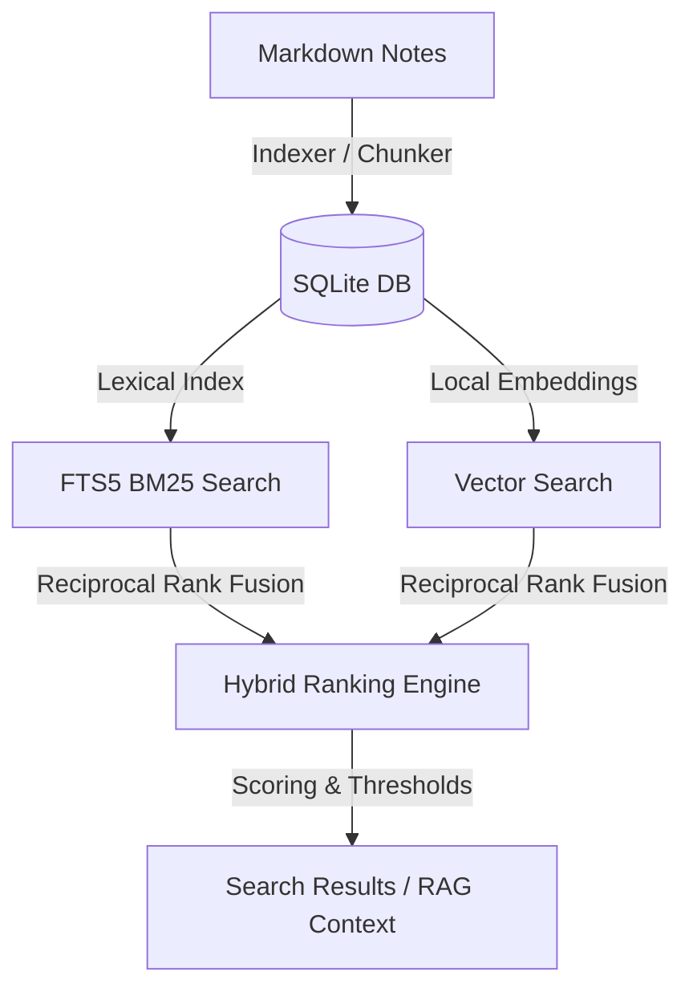

# Scribo

Scribo is a high-performance, local-first knowledge management and search assistant. It provides hybrid retrieval capabilities, combining lexical search and semantic vector embeddings to query local Markdown vaults with high precision.

---

## Architecture Overview

Scribo is built using **Tauri**, **Rust**, and **SQLite**. The system performs AST-driven Markdown parsing, indexes content into a virtual FTS5 text search table, and computes semantic vectors locally.



---

## 1. Retrieval Subsystem

The retrieval engine integrates keyword search (FTS5 BM25) and semantic vector search (cosine similarity scanning) using Reciprocal Rank Fusion (RRF).

### Execution Flow

```
1. CLI/Tauri Command (e.g. cli/query.rs or commands/search.rs)
   └─ Parses incoming arguments and options.

2. search service (services/search.rs)
   └─ Resolves DbState and prepares the RetrievalConfig.

3. retrieval pipeline (retrieval/pipeline.rs::retrieve)
   ├─ stages/translate_query.rs (optional query translation)
   ├─ stages/hyde.rs            (optional synthetic document generation)
   ├─ stages/synonyms.rs        (optional query expansion)
   │
   ├─ Parallel Execution (per variant):
   │   ├─ db/repos/fragments.rs::search        (Keyword FTS5 branch)
   │   └─ db/repos/fragments.rs::vector_search (Vector Cosine branch)
   │
   ├─ fusion.rs::rrf (Reciprocal Rank Fusion over branches and variants)
   ├─ rerankers/ (optional scoring or listwise LLM reranking)
   │
   └─ Returns: Vec<SearchResult>
```

### Module Structure

The backend source code under `src-tauri/src/retrieval/` includes:
- `pipeline.rs` — Central orchestrator defining `retrieve` and `fetch`.
- `types.rs` — Public configurations, filter/retrieve options and API structs.
- `fusion.rs` — Reciprocal Rank Fusion (RRF) algorithm.
- `language.rs` — Language detection and mapping logic.
- `stages/` — Pre-fusion query expansions/manipulations:
  - `translate_query.rs` — Query translation stage.
  - `hyde.rs` — Hypothetical Document Embeddings stage.
  - `synonyms.rs` — Static and LLM-driven synonym expansion.
- `rerankers/` — Post-fusion LLM-driven ranking updates.

---

## 2. Decoupled Retrieval Calibration

To maintain optimal search quality, Scribo includes an isolated parameter tuning pipeline. It runs on static JSON files without modifying or seeding the production database.

- **`calibration_notes.json`**: Ground-truth note entities used as the corpus.
- **`calibration_queries.json`**: Expected queries, target note matches, and relevance weights.

The calibration engine indexes these files into a temporary in-memory SQLite connection, executes the queries, and searches combinations of embedding weights, RRF constants, and confidence thresholds via grid search to maximize the Mean Reciprocal Rank (MRR).

---

## 3. Command Line Interface (CLI)

You can interact with Scribo's engine using the following subcommands within `src-tauri`:

### Force Reindexing
Re-processes all notes and rebuilds vector embeddings:
```bash
cargo run -- reindex --force
```

### Parameter Calibration
Optimizes retrieval configurations and writes results to the `meta` settings table:
```bash
cargo run -- calibrate
```

### Search Query
Performs a hybrid search query:
```bash
cargo run -- query "что такое молекула" -k 3
```

### Add Evaluation Alias
Appends a custom evaluation alias to the dataset:
```bash
cargo run -- add-alias "атом" "Atom" --relevance 1.0
```
